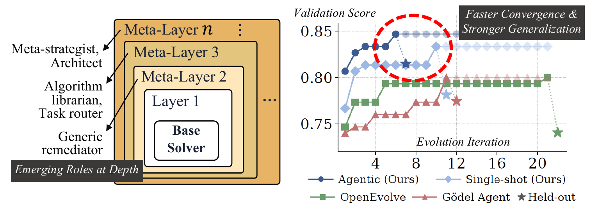
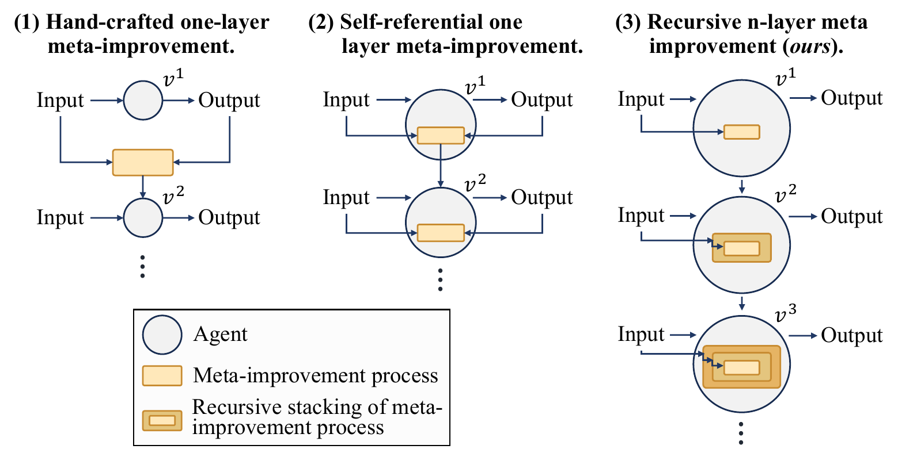
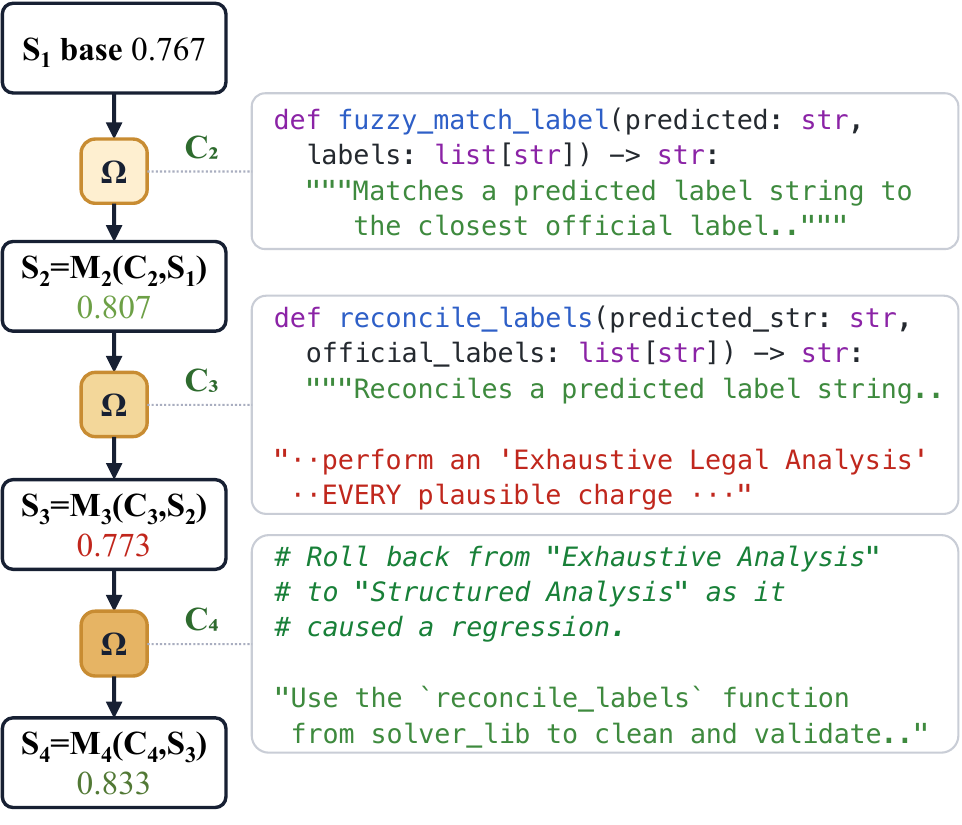
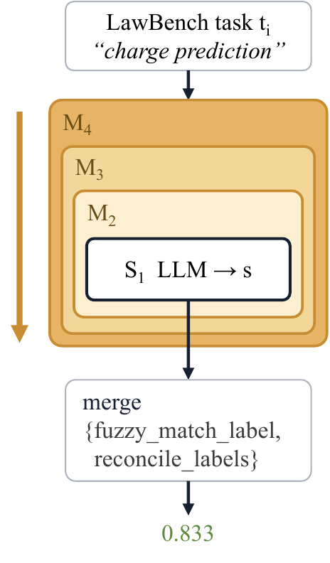

# Meta^n: Recursive Self-Improvement through Emergent Depth

[](pyproject.toml)
[](LICENSE)

Most "self-improving" agent loops refine *answers*, not the process that produces them. Meta^n instead keeps a single universal meta-operation **Ω** fixed and recurses on its **input**: Ω reads execution traces from the layers below and writes *executable code* (a `pre_process` hook plus a `code_library` of utilities) that is injected into the layer beneath it, changing its behavior. Applied repeatedly, this produces a stack of self-improving agent layers whose roles emerge from context rather than being prescribed — meta-layers are **constructive** (they write code) rather than merely **evaluative** (accept/reject).

<p align="center">
  
</p>

## How it works

Prior systems either hand-craft a single meta-improvement layer or make one layer edit itself; Meta^n instead stacks the *same* fixed meta-operation recursively, so depth is bounded by usefulness rather than by design:

<p align="center">
  
</p>

The stack itself is:

- **Layer 0 — `BaseExecutor`**: runs candidate scripts (locally or in a Docker sandbox) and captures a `Trace` (commands, errors, reasoning, success).
- **Layer 1 — default solver**: an LLM agent that reads a task description and produces a solution (`Layer1Solver`, or the iterative `AgenticSolver`).
- **Layer 2+ — emergent**: generated by Ω from execution traces of the layers below.

Search alternates two steps. In the **build step** (left), Ω reads the execution traces of the current stack and writes the code for a new meta-layer — helper functions, prompt directives, or rollbacks of a regressing change. In the **run step** (right), the nested stack `Mₙ(…M₂(S₁))` executes on each task, with every layer's injected code applied around the base solver:

<p align="center">
  
  
</p>

(The chain shown is a real LawBench charge-prediction lineage from the accompanying paper: Ω injects a fuzzy label matcher, a later over-aggressive prompt change causes a regression, and the next layer rolls it back and standardizes on the verified helper — lifting the score from 0.767 to 0.833.)

| Component | Role |
|-----------|------|
| `MetaLayer` | Wraps an inner layer and applies injected code (`pre_process`, `code_library`) |
| `Trace` | Execution record: commands, errors, reasoning, success/score |
| `InjectedCode` | Output of Ω — a `pre_process` hook and a `code_library` dict |
| `OmegaEngine` | Calls the LLM with the universal Ω prompt and parses the response into `InjectedCode` |
| `Archive` | Monotonically growing collection of evaluated `Candidate` chains; tracks per-task best and supports weighted parent selection |
| `EvolutionaryOrchestrator` | Archive-based evolutionary search loop — the only orchestrator |
| `AgenticSolver` | Terminus-2-style iterative solver with two-stage completion confirmation |

**Run model**: search is driven by the archive-based `EvolutionaryOrchestrator` (`--max-iterations` / `--patience`), so `--use-archive` is required. The bundled config `meta_n/configs/benchmark_features.yaml` is loaded by default and turns on the metacognition stack per benchmark; precedence is explicit CLI flag > per-benchmark block > defaults block > code default. `--benchmark-config none` reproduces bare behavior, and the single-draw best-of-N control is `--use-archive --benchmark-config none --max-iterations 0`.

## Benchmarks

Nine benchmarks are supported via `--benchmark`:

| `--benchmark` | What | Size | Scoring |
|---------------|------|------|---------|
| `co_bench` | CO-Bench combinatorial optimization (operations research) | 36 tasks | per-instance objective → `norm_score` ~[0,1], averaged |
| `symptom2disease` | Symptom2Disease medical diagnosis (English) | 22 classes | exact-match accuracy |
| `lawbench_charge` | LawBench task 3-3 charge prediction (multi-label, Chinese) | — | per-example F1, averaged |
| `terminal_bench` | TerminalBench 2.0 terminal-agent tasks, via `harbor` | ~113 tasks | binary reward |
| `swe_bench_verified` | SWE-bench Verified, real GitHub issues | 500 issues | % resolved |
| `alphaevolve_math` | AlphaEvolve Math (OpenEvolve family) | — | `combined_score` |
| `symbolic_regression` | Symbolic Regression (OpenEvolve) | — | `combined_score = -log10(mse + 1e-9)` |
| `algotune` | AlgoTune (OpenEvolve) | — | `combined_score` |
| `arc_agi_2` | ARC-AGI-2 abstract reasoning | 120 eval tasks | pass@2 |

Benchmark datasets are **not** bundled in this repo — see [`data/README.md`](data/README.md) for how each is obtained (setup scripts for ARC-AGI-2 and the OpenEvolve trio, auto-download for the classification tasks and TerminalBench/SWE-bench, upstream release for CO-Bench). Default data dir is `./data/<benchmark>`, overridable with `--bench-data-dir`.

## Install

Python **≥ 3.11** (CI runs 3.11 and 3.12).

```bash
python -m venv .venv && source .venv/bin/activate
pip install -e .                                     # core
pip install -e ".[dev,bench,classify,openevolve]"    # + extras you need
```

Extras: `dev` (pytest), `bench` (co_bench solvers), `classify` (HF datasets), `analysis` (plots/embeddings), `harbor` (TerminalBench/SWE-bench), `openevolve`/`openevolve-jax` (OpenEvolve trio), `terminus2`/`openhands` (external agent SDKs — install against the committed locks under `constraints/`). The Docker CLI must be on PATH for the TerminalBench/SWE-bench paths.

API keys live in a `.env` at the repo root (`OPENROUTER_API_KEY`, or `AZURE_OPENAI_API_KEY` + `AZURE_OPENAI_ENDPOINT` for `azure/` models); `source .env` before running.

### External-agent base solvers (optional)

`--base-solver {builtin,openhands,terminus2}` selects the program that solves each task. The OpenHands / Terminus 2 SDKs live in a **separate** `.venv_external_agents` built by `bash scripts/install_external_agents.sh` (expects a terminal-bench checkout: `git clone https://github.com/harbor-framework/terminal-bench baselines/terminal-bench`); meta-n never imports them in-process — the backends spawn child-process runners (`scripts/{oh,t2,oh_tb,builtin_tb}_runner.py`) under that venv. External backends require `--use-archive` and `--daily-budget-usd > 0`, and add a cost guard, a bounded Docker-lease guard, and a JSONL telemetry ledger.

## Quickstart

```bash
source .env

# CO-Bench on 10 tasks via OpenRouter (archive/evolutionary, default config)
meta-n --benchmark co_bench --bench-limit 10 --use-archive \
  --model anthropic/claude-sonnet-4-20250514 \
  --max-iterations 20 --output-dir ./experiments/run_x

# Any OpenAI-compatible endpoint (LM Studio / vLLM / Azure)
meta-n --benchmark co_bench --bench-limit 5 --use-archive \
  --base-url http://127.0.0.1:1234/v1 --model gemma-4-31b-it-mlx --api-key lm-studio

# External base solver (OpenHands on TerminalBench)
meta-n --benchmark terminal_bench --base-solver openhands \
  --use-archive --daily-budget-usd 200 --agent-max-budget 0.5 --max-docker 4

# Custom tasks (local executor, bare defaults)
meta-n --tasks examples/toy_tasks.json --use-archive --model <model> --base-url <url>
```

`meta-n` and `python -m meta_n.main` are equivalent entry points; see `meta-n --help` for the full argument list and `scripts/run_agentic_stage*.sh` / `scripts/run_tb2_*.sh` for full-scale invocation patterns.

Each run writes to `experiments/<exp-name>/`: `config.json`, `summary.json` (aggregate scores), `convergence.json` / `oracle_convergence.json`, `checkpoint.json` (resumable), `archive/index.json`, per-candidate `traces/` + `injected_code_d*.json`, and `llm_io/*.jsonl` logs of every LLM call.

## Status

Meta^n is a **research prototype**. Its demonstrable properties are a monotone archive that behaves as a ≥ best-of-N order statistic and a working code-injection channel (the `code_library` improves the solver when fed a correct helper). Empirical results are exploratory and should not be read as headline wins — see the accompanying paper for the full analysis.

## Testing

```bash
pytest tests/ -m "not slow"      # what CI runs
pytest tests/external_agents/ -q # LLM-free external-agents gate (no SDK / Docker)
```

On-disk artifact shapes (`summary.json`, `checkpoint.json`, `archive/index.json`, telemetry rows) are byte-for-byte contracts pinned by `tests/test_persistence_compat.py` and `tests/golden/` — do not change them casually. To add a benchmark, implement a `BenchmarkAdapter` under `meta_n/integrations/` and wire it into `meta_n/main.py`.

## License

Released under the [MIT License](LICENSE).
